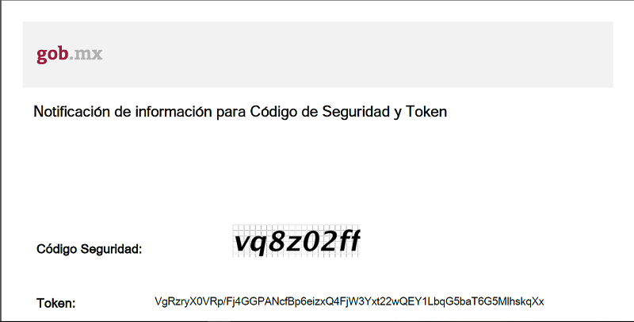
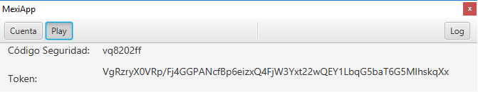

# MexiApp
MexiApp is a small application that helps you download the pdf sent by [MEXITEL](https://mexitel.sre.gob.mx/citas.webportal/pages/public/login/login.jsf) to your email and get the code and token provided.

## Problem to solve
To make an appointment in MEXITEL and finish the process, it sends a pdf file that contains a code and a token to the user email, and that the user must use to validate the appointment by copying them in the fields provided by MEXITEL for such validation. The problem is that the code is an image and the token is very long, and MEXITEL gives a very short time limit for the user to enter the information required, when doing it manually takes a long time.

## Features
- Speeds up the process of downloading and reading the pdf file.
- Allows to get the code and token from the clipboard.

## Note
Works with Gmail only, if you want that work with other email server modify the ```Mail.java``` file.

## Example
**PDF:**


**Result:**

